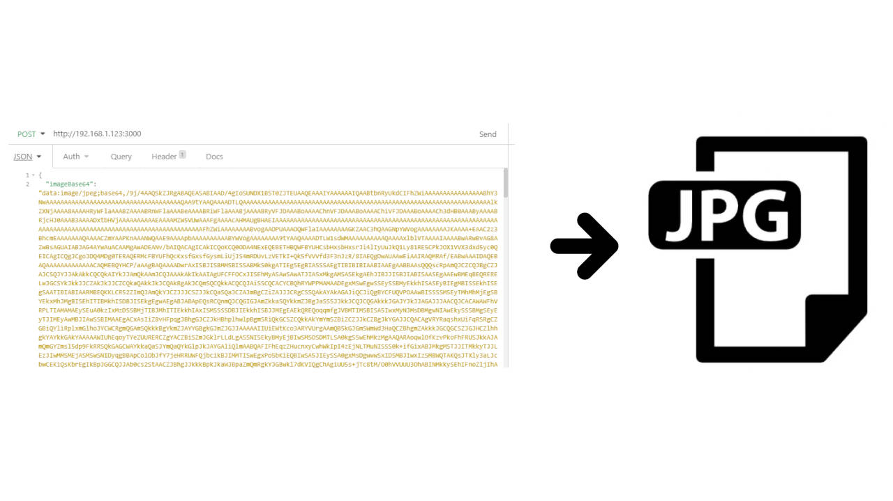

# ImageUploadOnNode
Simple project to upload image from object JSON in Node v14

This project read a body POST from a request, any other information in my blogger [nayosx blogger](https://nayosx.blogspot.com/2021/03/subir-imagenes-base64-con-node.html)